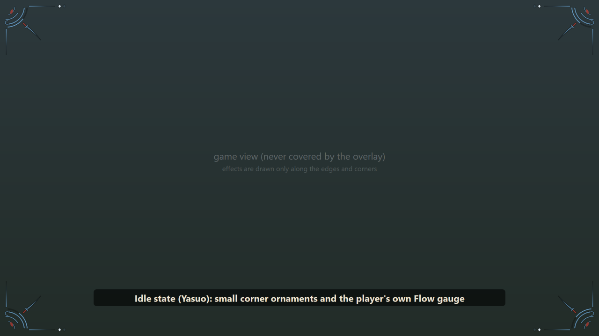
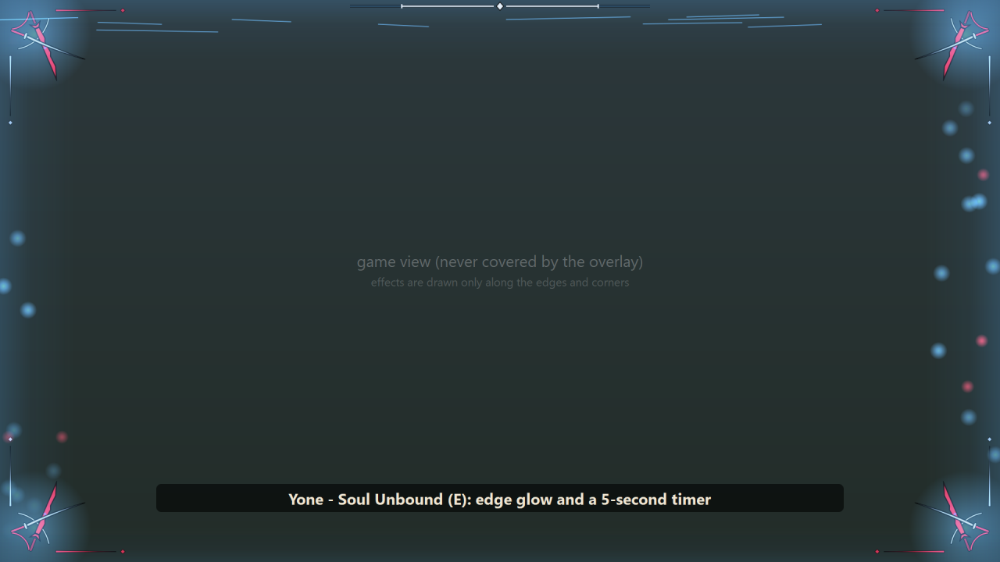
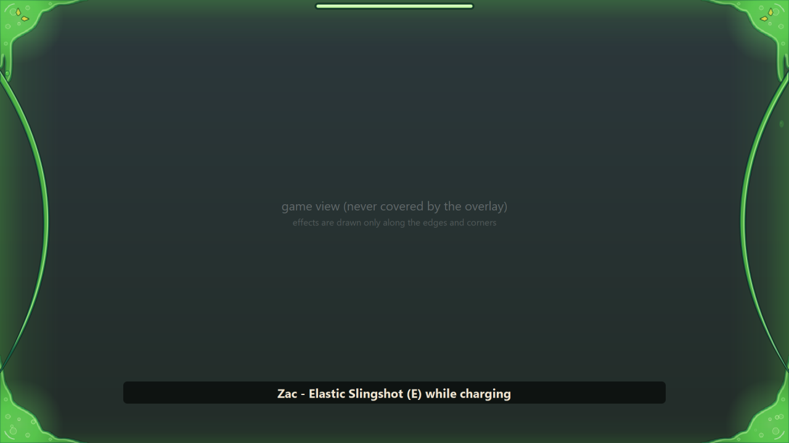
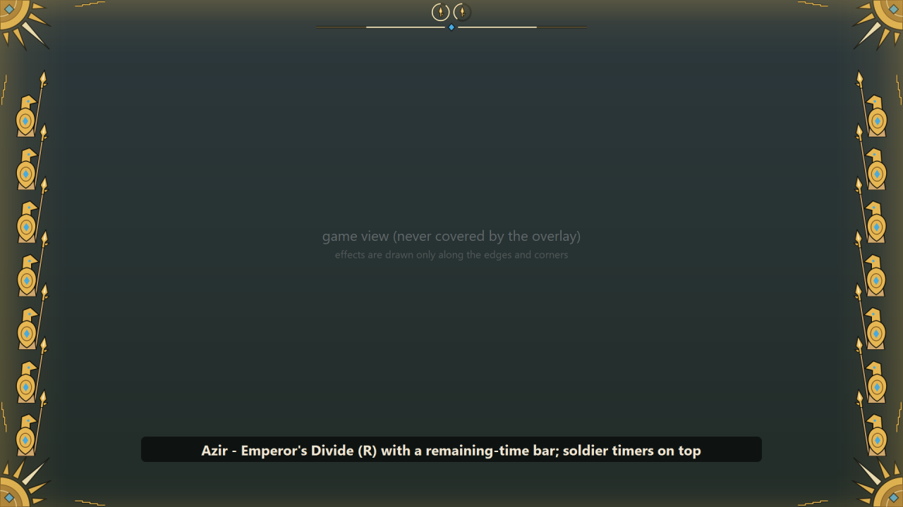
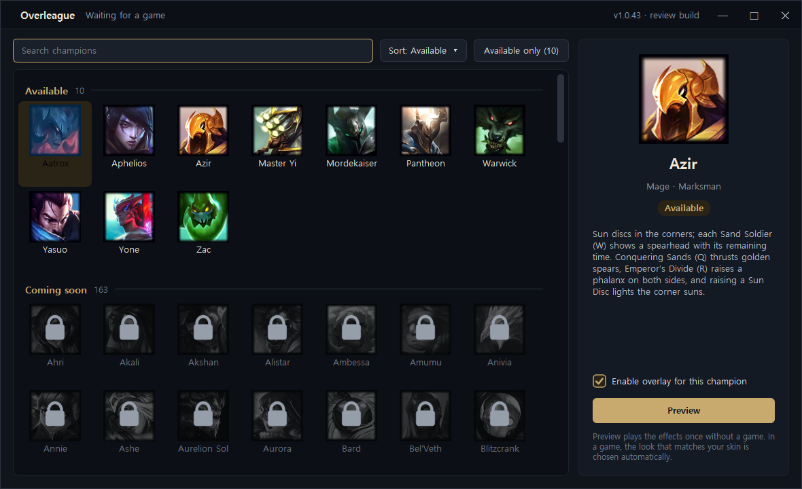

# Overleague

**Cosmetic, champion-themed screen effects for League of Legends (Windows desktop app).**

When you cast an ability or your ultimate, Overleague plays a short themed animation on your own screen, matched to your champion and skin. It is decoration: it does not read or change the game, does not send input, and does not look for other players on your screen.

Thirty-two champions have custom, hand-made effects. Every other champion is shown as locked ("coming soon") in the app; effects for all champions are planned.

> Overleague isn't endorsed by Riot Games and doesn't reflect the views or opinions of Riot Games or anyone officially involved in producing or managing Riot Games properties. Riot Games, and all associated properties are trademarks or registered trademarks of Riot Games, Inc.

---

## Try it (review build, English, no sign-in)

1. Download **[OverleagueReview.exe](https://github.com/freeiam1125-glitch/champion-overlay/raw/review/OverleagueReview.exe)** (about 25 MB, single file).
2. Run it. It runs from wherever you saved it: nothing is installed, there is no sign-in, and it does not update itself. It creates a few small settings/log files next to the exe. Closing the window leaves it in the system tray; choose **Quit** there to stop it.
3. Pick an available champion and press **Preview** to see its effects without a game, or start a game (Practice Tool works) on that champion.

Windows SmartScreen may warn that the file is unrecognised because it is not code-signed yet.

The review build is the same program as the regular build with three differences: the window is in English, it is open to everyone, and it has no installer or auto-updater. The regular build is in Korean and, while in closed testing, only turns on for testers on an allow-list.

## At a glance

| | |
|---|---|
| Platform | Windows 10 / 11, single `.exe` |
| Game | League of Legends |
| Price | Free (closed testing with a small group) |
| Data sources | Riot **Live Client Data API** on the local machine; plain screen captures of the player's **own** ability bar and own name plate |
| Game memory / game files / input to the game | **Not read, not modified, not sent** |
| Enemy champions | **Not searched for on screen.** No positions, health, cooldowns or timers of other players are shown |
| Network | Local Live Client Data API; public icon downloads; (regular build only) GitHub for updates and the tester allow-list. No player data is uploaded |

## What it looks like

The pictures below are rendered by the app's own preview with no game running. The dark area stands in for the game view.

**Idle** – small corner ornaments, and for some champions a gauge of the player's own resource.

**While an ability is active** – a timer for the player's own ability and an edge effect.

**Ultimate**

**The desktop window** – choose which champions' effects are on, and preview them without a game.

### Where on the screen

- **Aatrox, Aphelios, Azir, Caitlyn, Cho'Gath, Evelynn, Ezreal, Fiddlesticks, Hwei, Jhin, Karthus, Kayle, K'Sante, Lissandra, Mel, Nocturne, Pantheon, Pyke, Renekton, Twitch, Urgot, Varus, Veigar, Viktor, Volibear, Warwick, Yasuo, Yone, Zac, Zeri:** effects are drawn only along the edges, the corners and a thin strip at the top. The middle of the screen is left clear.
- **Master Yi and Mordekaiser** (the first two that were made): during the ultimate they draw a translucent full-screen frame — a vignette that is strongest at the edges, with light streaks and particles that can pass over the play area. Nothing opaque is placed over the middle.

## Supported champions

**Custom effects:** Aatrox, Aphelios, Azir, Caitlyn, Cho'Gath, Evelynn, Ezreal, Fiddlesticks, Hwei, Jhin, Karthus, Kayle, K'Sante, Lissandra, Master Yi, Mel, Mordekaiser, Nocturne, Pantheon, Pyke, Renekton, Twitch, Urgot, Varus, Veigar, Viktor, Volibear, Warwick, Yasuo, Yone, Zac, Zeri. Most have variants that follow the player's current skin (read from the Live Client Data API skin ID).

**All other champions:** listed in the app but locked, with a "coming soon" note. Champion-specific effects are planned for all of them.

## How it works

1. **Detecting a game.** The app polls `https://127.0.0.1:2999/liveclientdata/` (Riot's official local API). If the active player is on a supported champion, that champion's overlay is created.
2. **Knowing when to play an effect.** In order of preference:
   - **Live Client Data API values for the active player:** champion, skin ID, ability levels, resource value (mana / energy / champion bar), health, movement speed, plus the player list and the event list (kills and assists).
     Examples: Azir's, Mel's, Veigar's, Nocturne's, Pyke's, Fiddlesticks', Karthus', Varus', Ezreal's, Caitlyn's, Zeri's, Viktor's, Cho'Gath's, Hwei's, Urgot's, Evelynn's, Volibear's, Kayle's, K'Sante's, Jhin's, Lissandra's and Twitch's abilities are recognised by the mana they cost right after the key is pressed; Warwick's Blood Hunt by his own movement speed; Karthus' Defile toggle by the E key together with the steady mana drain; Renekton has no mana, so his abilities are read from key presses and a Fury drop marks empowered casts; Veigar's Phenomenal Evil display shows the player's own ability power value. The ability keys the app listens for can be set in Settings: the default mouse scheme (Q/W/E/R), the keyboard (WASD) movement scheme (right click / Shift / E / R), or custom keys.
   - **The player's own ability bar,** when the API does not expose the needed state (for example whether an ability icon has switched to its "recast" picture, or is on cooldown). The app takes an ordinary Windows screen capture (GDI `BitBlt`) of a small rectangle around the player's own ability icons at the bottom of the screen and compares it with the public ability icons.
   - **The player's own name plate.** To blink the ornaments red while the player's own champion is crowd-controlled, the app looks at the name plate above the player's own champion, where the game shows the crowd-control name and its remaining-time bar.
   - **Key state** of the player's own ability keys (`GetAsyncKeyState`, polled; no keyboard hook), only to time the animation.
3. **Drawing.** A transparent, click-through, always-on-top window owned by Overleague draws the animation. Mouse and keyboard input pass straight through to the game.

## What it does not do

- No reading or writing of game memory, no code injection, no hooks into the game process, no changes to game files.
- No input is sent to the game; nothing is automated.
- No searching for enemy champions on screen. No enemy positions, health, cooldowns, summoner spells, wards, or jungle/objective timers are shown.
- No gameplay advice, recommendations, or statistics.
- Nothing is hidden from the game or from anti-cheat: the app is an ordinary, visible Windows process.
- No player data is uploaded anywhere.

## Complete list of what can appear on screen

- Corner ornaments themed to the player's champion and skin (for champions without custom effects: colored from the champion's portrait with a role motif).
- Nothing inside the minimap area: the overlay window leaves a configurable rectangle at the bottom-right (or bottom-left) corner completely empty so the minimap is never covered.
- Animations when the player casts an ability or ultimate, gets a takedown, or dies.
- Timers and gauges for the **player's own** state: remaining time of the player's own ability, the player's own resource bar, stacks of the player's own passive.
- A red blink of the ornaments while the player's own champion is crowd-controlled.
- **Master Yi (ultimate):** a row of the enemy team's champion portraits, greyed out when that champion has died, and a remaining-time gauge that grows on takedowns. This uses only the player list and kill events from the Live Client Data API (the same information as the in-game scoreboard); nothing is read from the screen for it.
- **Mordekaiser (ultimate):** after the player kills the champion taken into Realm of Death, that champion's portrait is shown as a "soul collected" mark, again from the Live Client Data API kill event.

## Files and network

**Files written (next to the exe; the regular build uses `%LOCALAPPDATA%\Overleague`):**

- Settings (`suite.json`, `config_*.json`) and a text log (`overlay.log`, in Korean).
- Public ability icons and champion portraits (bundled; downloaded only if missing).
- Calibration captures: for some champions the app may save up to 30 small screenshots of the player's own bottom HUD strip (`hud_probe_*` folders) so that icon matching can be tuned. They stay on the PC and are never uploaded.

**Network destinations:**

| Destination | Purpose | Build |
|---|---|---|
| `127.0.0.1:2999` | Riot Live Client Data API (local) | both |
| `ddragon.leagueoflegends.com`, `raw.communitydragon.org` | Public champion portraits / ability icons that are not already bundled | both |
| `api.github.com`, `raw.githubusercontent.com` | Check for a new version; read the tester allow-list | regular build only |

The tester allow-list contains only salted hashes of Riot IDs and PC codes. The app compares locally; the player's Riot ID is not sent anywhere.

## Contact

Please use this repository's [issues](https://github.com/freeiam1125-glitch/champion-overlay/issues), or reply through the Riot Developer Portal.
